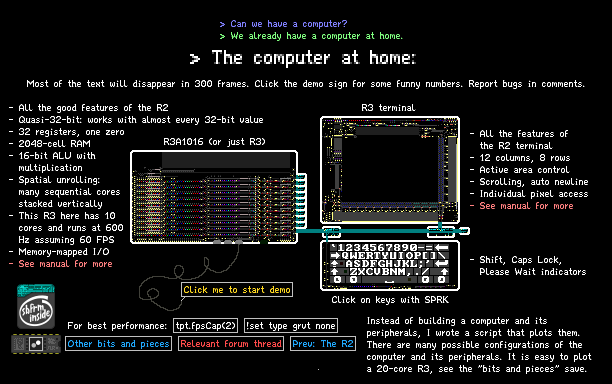

# R316

[The Powder Toy][000] is a [falling-sand game][001] that most people blow stuff up in. *Most people.*

There is a subculture that builds computers, because *of course* the game is Turing-complete. There is a different subculture that builds machines that rely on some of the game's less than intuitive and very much unintended mechanics to do their job. At the intersection of these subcultures are those who build *subframe computers*.

The author of this repo is one such tormented soul. This repo contains the code used to design (out-of-game) and plot (in-game) the R3 family of computers, and references to dependencies required for said code to work properly. Go check out [the manual](manual.md).

[000]: https://powdertoy.co.uk/
	"The Powder Toy official website"

[001]: https://en.wikipedia.org/wiki/Falling-sand_game
    "Falling-sand game on Wikipedia"
